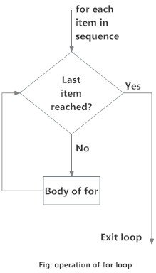
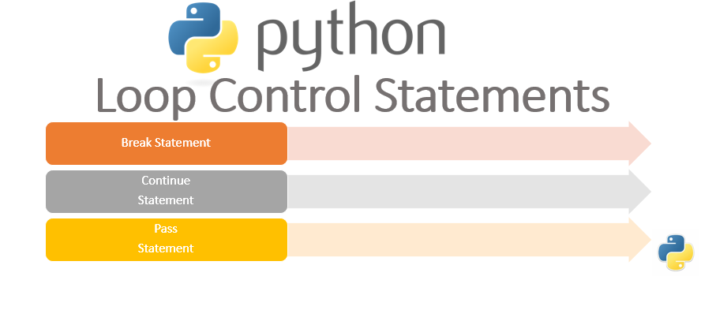

# Loops

Loops are one of the most **powerful** and basic concepts in programming. A loop can contain a set of statements that keeps on executing until a **specific condition is reached**.

Programming languages provide us the **concept of loops** which helps us in executing some task ***n number of times*** where n can be any whole number. They are pretty **useful** and can be **applied** to various use cases.

There are two types of loops in Python.

## The "for" loop

For loop iterate over a given sequence (range, list, tuple, string etc.) or other iterable objects. Iterating over a sequence is called traversal. Flow chart of for loop is:

<center>



</center>

## Looping through String

Even strings are iterable objects, they contain a sequence of characters:

```{python}
for letter in 'string':
  print(letter)
```

## Looping through a List

```{python}
Banks = ['ABL', 'MCB', 'NBP']
for bank in Banks:
  print(bank)
```

## How to Use Index

```{python}
Banks = ['ABL', 'MCB', 'NBP']
for i in range(3):
  print(i, Banks[i])
```

## Use of Enumerate for Indexing

```{python}
# Loop through the list and iterate on both index and element value

squares=['red', 'yellow', 'green', 'purple', 'blue']

for i, square in enumerate(squares):
    print(i, square)
```

We can change the elements in a list:

```{python}
# Use for loop to change the elements in list

squares = ['red', 'yellow', 'green', 'purple', 'blue']

for i in range(0, 5):
    print("Before square ", i, 'is',  squares[i])
    squares[i] = 'white'
    print("After square ", i, 'is',  squares[i])

```

Quick Quiz: Print the following pattern using for loop.

+++

++

+++++

+++

+++++++++

```{python}
list = [3,2,5,3,9]
for i in list:
  print('+'*i)
```

## Iterating over tuples

We can use for **loops to iterate** on a tuple. The for loop will keep on iterating until the elements in the tuples are exhausted.

```{python}
Tuple = ('SBP', 'NIBAF', 'BSC')
for entities in Tuple:
  print(entities)
```

## The range ( ) function

When using for loops in Python, the range() function is pretty useful to specify the number of times the loop is executed. It yields a sequence of numbers within a specified range.

syntax: range (start, stop, steps)

-   The first argument is the starting value. It is zero by default.

-   The second argument is the ending value of the range.

-   The third argument is the number of steps to take after each yield.

<!-- -->

### Iterating over range object

```{python}
# for loop
for i in range(2,10,3):
  print(i)

```

### an other for loop with else

```{python}
for char in 'SBP':
  print(char)
else:
  print('loop ended')
```

## Nested Loop

A nested loop is a loop inside a loop. The "inner loop" will be executed once for each iteration of the "outer loop" i.e., in each iteration of the outer loop, inner loop execute all its iteration. **For each iteration of an outer loop, the inner loop re-start and completes its execution** before the outer loop can continue to its next iteration.

```{python}
list1 = ['Rizwan', 'Adil', 'Ahmad']
list2 = ['JD', 'OG-4', 'SBP']
for officer in list1:
    for x in list2:
        print(f'({officer}, {x})')
```

Quick Quiz: Create Co-ordinate (0,0) ,(0,1) ,(0,2) , (1,0) ,(1,1) ,(1,2) ,(2,0) ,(2,1) ,(2,2) ,(3,0) ,(3,1) ,(3,2)

```{python}
for x in range(4):
  for y in range(3):
    print(f"({x},{y})")
```

## The "while" loop

The **while loop** in Python executes a block of code **until the specified condition becomes False**.

Flow chart of while loop is :

<center>


</center>

```{python}
count = 0 # Initializing, To Give an initial value to a variable
while count<10: # Setting a condition
  print(count)
  count+=2 # Incrementing the initial value by 2
```

In the example, the while statement checks if count is less than 10.

**Initially**, count is zero so the statement is true and it executes the body of while. Then the count gets incremented by 2. Again we check the condition and this goes on till the condition becomes false.

Here, when our code checks 10\<10, the statement returns False and so the code in while block is not executed.

### Example

```{python}
# While Loop Example

dates = [1982, 1980, 1973, 2000]

i = 0
year = dates[0]

while(year != 1973):    
    print(year)
    i = i + 1
    year = dates[i]
    

print("It took ", i ,"repetitions to get out of loop.")
```

## Infinite loop

A loop is called an infinite loop when the loop will never reach its end.

Usually, when a condition is always True in a while loop, the loop will become an infinite loop. So we should be careful when writing conditions and while updating variables used in the loop.

In Python shell, we can **stop/terminate** the program on an **infinite loop by using CTRL + C**. In jupyter notebook press `i` twice.

*Quick Quiz*: *Write a program to print 1 to 50 using a while loop*.

*Quick Quiz*: *Write a program to print the contents of a `list=['C', 'C++', 'java', 'fortran','python']` using while loop*.

## Loop control statements in Python

<center>



</center>

```{python}
num = 0
while num<10:
  num +=1
  if num==5:
    break
  print(num)

```

In this loop, we are **incrementing** the value of **num variable** and then printing it. When the num value becomes **5** the **break statement** is **executed** which **terminates** the loop and therefore loop is not **executed further**.

```{python}
num = 0
while num<10:
  num +=1
  if num==5:
    continue
  print(num)

```

Here, we see that when the **num** variable is equal to **5**, the **continue statement is executed**. It then **doesn't execute the lines after the continue statement** and the **control** is sent to the **next iteration**.

## Common Mistakes

1.  Mostly people forgte to initialize the variable.

2.  There is second issue, we might face if we forget to initialize the variables with the right value. we might have already used the variable in our program. if we reuse a variable without setting the correct value from the start, it will still have the value from before.

```{python}
x=1
sum = 0
while x<10:
  sum+=x
  x+=1
print(sum)
```

*Whenever you are writing a loop, check that you are initializing all the variables you want to use before you use them.*

```{python}
product = 1
x=1
while x<10:
  product=product*x
  x+=1
print(product) # what we call this outcome!
```

## Exercise

1.  A list of groceries is given below, print all items with its index.

        groceries = ["bananas","butter","cheese","toothpaste"]

2.  Make a combination of all the letters of 'SBP' and 'NIBAF'

3.  Write a program to say "hello" to all persons in a list which starts with M. `List = ['Ahmad', 'Muhammad', 'Essa', 'Mossa']`

4.  Print odd numbers in first 10 numbers using while loop.

5.  Also find the sum of all numbers in above question.

6.  Write a program to print the multiplication table of a number entered by the user, using **'for' loop.**

7.  Attempt above problem using while loop.

8.  Find the total of `[10,20,30]` using for loop.

9.  Write a program to guess a secrete number in 3 attempts using while loop.

10. Solve above problem while generating secrete number randomly.

11. Provide a hint to make problem easy, if guess is larger, then print 'its larger', otherwise 'its smaller'

12. Write a program whether a given number is prime or not.

13. Find the prime numbers in a given range.

14. store the numbers obtained in above question as a list.

15. Find the sum of all the numbers in the list above in question 14.

16. Challenge: calculate the time required to run the above code 500 times.

17. Draw the following pattern using nested loop.

    ```{python}
    #    xxxxx
    #    xx
    #    xxxxx
    #    xx
    #    xx
    ```

18. Make the co-ordinates (0,0,0) ...(2,2,2) using nested for loop.

19. Write a `for` loop the prints out all the element between **-5** and **5** using the range function.

20. Write a while loop to display the values of the Rating of an album playlist stored in the list `PlayListRatings`. If the score is less than 6, exit the loop. The list `PlayListRatings` is given by: `PlayListRatings = [10, 9.5, 10, 8, 7.5, 5, 10, 10]`

21. Write a program to sum first n natural numbers, take input from user.

22. Write program to find the factorial of a number n.

23. Write a program to print the following pattern.\

        *
        * *
        * * *
        * * * *
        * * * * *

24. Write a Python program to concatenate all elements in a list into a string and return it

25. Write a nested `for` loop program to print multiplication table in Python from 2 to 10.

26. Write a Python program to print all even numbers from a given numbers list in the same order and stop the printing if any numbers that come after 237 in the sequence.

    ```{python}
    numbers = [386, 462, 47, 418, 907, 344, 236, 375, 823, 566, 597, 978, 328, 615, 953, 345, 399, 162, 758, 219, 918, 237, 412, 566, 826, 248, 866, 950, 626, 949, 687, 217, 815, 67, 104, 58, 512, 24, 892, 894, 767, 553, 81, 379, 843, 831, 445, 742, 717, 958,743, 527]
    ```

27. Write a program to find those numbers which are divisible by 7 and multiple of 5, between 1500 and 2700 (both included) and print the result in the form of a list.
